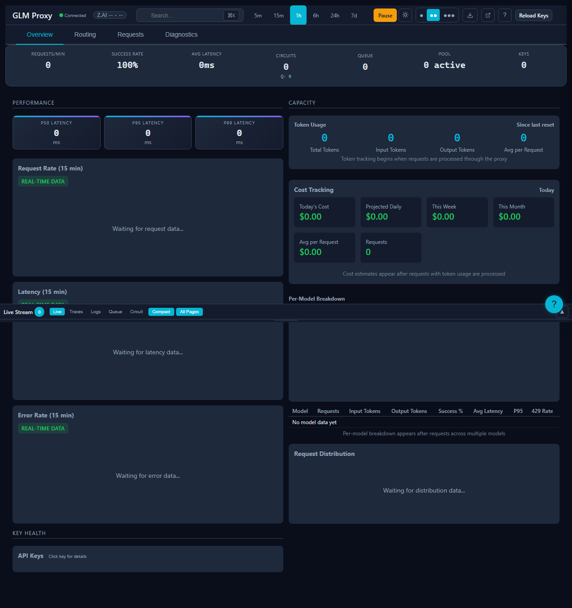

# Testing

Test strategy and coverage information for GLM Proxy.

## E2E Testing with Screenshots

The project uses Playwright for E2E testing, including automated screenshot generation for documentation:



### Screenshot Generation

Generate screenshots for documentation:

```bash
npm run screenshots:generate
npm run screenshots:extract
```

See [Screenshots Gallery](../screenshots/) for all available screenshots.

## Running Tests

### Run All Tests

```bash
npm test
```

### Run with Coverage

```bash
npm run test:verbose
```

## Test Structure

Tests are located in the `test/` directory:

```
test/
├── circuit-breaker.test.js      # Circuit breaker logic
├── config.test.js               # Configuration handling
├── key-manager.test.js          # Key management and rotation
├── rate-limiter.test.js         # Rate limiting
├── request-handler.test.js       # Request proxy logic
├── stats-aggregator.test.js     # Metrics collection
├── circular-buffer.test.js       # Latency tracking
└── ...
```

## Test Strategy

### Unit Tests

- Individual module testing in isolation
- Mocked dependencies
- Fast execution

### Integration Tests

- End-to-end request flow
- Component interaction
- Real HTTP server (test port)

## Coverage Tracking

Current coverage status is tracked in:

- **`test/COVERAGE_DEBT.md`** - Coverage gaps and improvement plan

## Coverage Goals

| Module | Target | Current |
|--------|--------|---------|
| Core logic | 90%+ | TBD |
| Error handling | 95%+ | TBD |
| Edge cases | 80%+ | TBD |

## Writing New Tests

### Test Template

```javascript
describe('module-name', () => {
  beforeEach(() => {
    // Setup
  });

  afterEach(() => {
    // Teardown
  });

  test('should do something', () => {
    // Arrange
    const input = {};

    // Act
    const result = functionUnderTest(input);

    // Assert
    expect(result).toBe(expected);
  });
});
```

## Test Quarantine

Tests that are temporarily disabled are tracked in:

- **`test/quarantine/QUARANTINE_EXIT.md`** - Quarantined tests and exit criteria

## Continuous Integration

Tests run automatically on:

- Every push
- Every pull request
- Before release

## Debugging Tests

### Run Single Test File

```bash
npm test -- path/to/test.test.js
```

### Run Specific Test

```bash
npm test -- -t "test name pattern"
```

### Debug Mode

```bash
NODE_ENV=test node --inspect-brk node_modules/.bin/jest --runInBand
```

## Test Data

Test fixtures and mocks:

- Mock API keys in test setup
- Sample responses for testing
- Error scenario mocks

## See Also

- [TEST_PLAN.md](../../../test/TEST_PLAN/) - Comprehensive test strategy
- [COVERAGE_DEBT.md](../../../test/COVERAGE_DEBT/) - Coverage tracking
