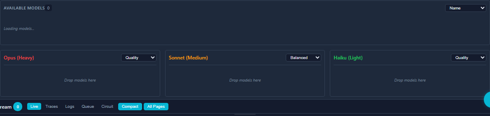

# Model Routing

Complexity-aware routing layer that sits above the legacy `ModelMappingManager`. Routes Anthropic `/v1/messages` requests to GLM target models based on request complexity, supporting rule-based matching, heuristic classification, per-model cooldowns, and failover.

When `enabled: false` (default), the router is constructed but `selectModel()` returns `null`. All traffic falls through to the legacy `ModelMappingManager`. You can configure the router while disabled and toggle on without restart.

> **Related Documentation:**
> - [Z.ai Coding Subscription Reference](../reference/zai-coding-subscription.md) - Quick tier comparisons and limits
> - [Z.ai Knowledge Base](../reference/zai-knowledge-base.md) - Comprehensive model specs, API details, and integrations

## Dashboard Visualization

### Accessing the Routing Page

Navigate to the Model Routing page using the page navigation tabs:


### Model List View

The routing page displays all configured models with their tier assignments, pricing, and concurrency limits:


Each model card shows:
- Model name and tier assignment
- Input/output token pricing
- Current and maximum concurrency
- Add/remove controls for tier management

### Tier Builder

Configure routing tiers using the drag-and-drop interface:



The tier builder lets you:
- Assign models to tiers (light, medium, heavy)
- Configure fallback chains for each tier
- Set routing strategies (balanced, quality, throughput)

## Quick Start

Minimal config to enable routing:

```json
{
  "modelRouting": {
    "enabled": true,
    "tiers": {
      "light": { "targetModel": "glm-4.5-air", "clientModelPolicy": "always-route" },
      "medium": { "targetModel": "glm-4.6", "clientModelPolicy": "always-route" },
      "heavy": { "targetModel": "glm-4.7", "clientModelPolicy": "always-route" }
    }
  }
}
```

This routes all requests through the heuristic classifier. Light requests go to `glm-4.5-air`, medium requests to `glm-4.6`, and heavy requests to `glm-4.7`.

## Routing Precedence

Strict order, first match wins:

1. **Per-request UI override** -- `x-model-override` header (requires admin auth)
2. **Saved overrides** -- set via dashboard or API
3. **Config rules** -- evaluated in array order, first match wins
4. **Heuristic classifier** -- only when at least one tier has `clientModelPolicy: "always-route"`
5. **`defaultModel` fallback**
6. **Legacy `ModelMappingManager`** -- when router returns `null`
7. **Passthrough** -- original model unchanged

When the router selects a model (steps 1--5), the result bypasses the legacy `ModelMappingManager` entirely.

## Configuration Reference

Full config block with defaults:

```json
{
  "modelRouting": {
    "enabled": false,
    "defaultModel": null,
    "tiers": {
      "light": {
        "targetModel": "glm-4.5-air",
        "fallbackModels": ["glm-4.6"],
        "clientModelPolicy": "rule-match-only"
      },
      "medium": {
        "targetModel": "glm-4.6",
        "fallbackModels": ["glm-4.5-air"],
        "clientModelPolicy": "rule-match-only"
      },
      "heavy": {
        "targetModel": "glm-4.7",
        "fallbackModels": ["glm-4.6", "glm-4.5-air"],
        "clientModelPolicy": "rule-match-only"
      }
    },
    "rules": [],
    "classifier": {
      "heavyThresholds": {
        "maxTokensGte": 4096,
        "systemLengthGte": 2000,
        "messageCountGte": 20,
        "hasTools": true,
        "hasVision": true
      },
      "lightThresholds": {
        "maxTokensLte": 512,
        "messageCountLte": 3
      }
    },
    "cooldown": {
      "defaultMs": 5000,
      "maxMs": 30000,
      "decayMs": 60000,
      "backoffMultiplier": 2,
      "maxCooldownEntries": 50
    },
    "failover": {
      "maxModelSwitchesPerRequest": 1
    },
    "logDecisions": true,
    "overridesFile": "model-routing-overrides.json",
    "maxOverrides": 100
  }
}
```

### Tier Policies

| Policy | Behavior |
|--------|----------|
| `rule-match-only` | Tier only activates if a rule explicitly matches. Safe default. |
| `always-route` | Tier activates via heuristic classifier when no rule matches. Enables automatic load spreading. |

### Rules

Rules are evaluated in array order. First match wins. All match conditions within a rule use AND logic.

```json
{
  "rules": [
    { "match": { "model": "claude-3-haiku-*" }, "tier": "light" },
    { "match": { "model": "claude-opus-*" }, "tier": "heavy" },
    { "match": { "maxTokensGte": 8192, "hasTools": true }, "tier": "heavy" }
  ]
}
```

Match conditions:

| Condition | Type | Description |
|-----------|------|-------------|
| `model` | glob | Pattern with `*` wildcards against the request model name |
| `maxTokensGte` | number | `max_tokens >= value` (skipped when `max_tokens` absent) |
| `messageCountGte` | number | `messages.length >= value` |
| `hasTools` | boolean | `true` if tools array is non-empty |
| `hasVision` | boolean | `true` if any message contains image content |

### Classifier

When at least one tier has `always-route`, the classifier evaluates request features against thresholds:

- Any **heavy** threshold met --> `heavy` tier
- All **light** thresholds met --> `light` tier
- Otherwise --> `medium` tier

`maxTokens` thresholds are only evaluated when the request includes `max_tokens`. Requests without `max_tokens` are not incorrectly classified as light.

### Cooldowns

Per-model cooldown tracking with exponential backoff. When a target model returns 429:

1. Cooldown recorded: `retryAfterMs * backoffMultiplier^(hitCount-1)`, capped at `maxMs`
2. On next routing decision, if `targetModel` is cooled down, try `fallbackModels` in order (skipping cooled and already-attempted)
3. If all candidates are unavailable, use `targetModel` (best effort)
4. Cooldown count resets after `decayMs` without a 429
5. Map size is capped at `cooldown.maxCooldownEntries` (default: 50). When a new model needs tracking and the map is full, the entry with the oldest `lastHit` is evicted

### Pool Burst Dampening

When multiple API keys hit 429 simultaneously (a pool burst), the model router dampens cooldown values to prevent over-penalizing models that are only temporarily rate-limited at the pool/account level.

**How it works:**

1. During a pool burst (`isPoolBurst = true`), the cooldown value applied to the model is reduced by `burstDampeningFactor` (default: 0.2, range: 0-1)
2. The `count` field is NOT incremented during burst-dampened recordings, preventing exponential backoff escalation from concurrent 429s
3. A burst-dampened cooldown can never shorten an existing longer cooldown (`max()` semantics)

**Configuration:**

```json
"cooldown": {
    "burstDampeningFactor": 0.2
}
```

A factor of 0.2 means a 5000ms computed retry delay becomes `max(100, round(5000 * 0.2))` = 1000ms for the model cooldown during a pool burst.

**Prometheus metric:**

```
glm_proxy_model_routing_cooldowns_recorded_total{mode="normal"} 42
glm_proxy_model_routing_cooldowns_recorded_total{mode="burst"} 5
```

**Dashboard:** Burst-dampened cooldowns appear with reduced opacity and a `(burst)` tag next to the model name.

### Observability Dashboard

The dashboard includes a "Routing Observability" panel showing:

- **Burst Share / Failover Share**: Window-relative ratios (burst-dampened or failover decisions / total decisions in the selected time window)
- **429/min**: Upstream 429 rate within the window
- **Pool Cooldown**: Current pool cooldown status
- **Decisions by Tier**: Doughnut chart (light/medium/heavy)
- **Decisions by Source**: Doughnut chart (override/rule/classifier/default/failover)
- **429s & Burst Dampening**: Time-series with selectable window (5m/1h/24h)
- **Copy Snapshot JSON**: Exports current routing stats, cooldowns, and config for debugging

### Fallback Chains (v1.1+)

Each tier supports an ordered list of fallback models via `fallbackModels[]`:

```json
"heavy": {
    "targetModel": "glm-4-plus",
    "fallbackModels": ["glm-4-air", "glm-4-flash"],
    "clientModelPolicy": "always-route"
}
```

When the target model is cooled down (429), the router tries fallback models in order, skipping any that are also cooled down or were already attempted in this request lifecycle.

**Backward compatibility:** The deprecated `failoverModel` (string) is still supported. If `fallbackModels` is absent or empty, `failoverModel` is automatically wrapped as `[failoverModel]`. When both are set, `fallbackModels` takes precedence.

**`failover.maxModelSwitchesPerRequest`** (default: 1) caps how many times a model can be switched during a single request's retry loop. With the default of 1:
- First attempt uses `targetModel`
- On 429, retry switches to first available fallback
- On another 429, no further model switch (uses current model as best-effort)

Set to a higher value for deeper fallback chains:
```json
"failover": {
    "maxModelSwitchesPerRequest": 3
}
```

Maximum `fallbackModels` array length: 10.

## Overrides

### Saved Overrides

Set via API or dashboard. Persisted to `model-routing-overrides.json` (gitignored).

```json
{ "key": "claude-opus-4-5", "model": "glm-4.7" }
```

- Specific model key routes only that model
- Wildcard `*` routes all models: `{ "key": "*", "model": "glm-4.5-air" }`
- Specific model takes priority over wildcard

The total number of saved overrides is capped at `maxOverrides` (default: 100). When the limit is reached, new keys are rejected with a warning log. Updates to existing keys are always allowed.

### Per-Request Override

Send the `x-model-override` header on `/v1/messages` requests:

```bash
curl -H "x-model-override: glm-4.7" \
     -H "X-Admin-Token: your-token" \
     http://localhost:8080/v1/messages -d '...'
```

Requires admin auth when enabled. Silently ignored on auth failure (does not reject the request).

### Override Persistence

- Overrides are persisted to `{configDir}/model-routing-overrides.json` via atomic writes
- This file is gitignored by default
- Cluster workers do NOT write overrides (only the primary process persists)

## Replay Behavior

Replay requests (`POST /replay/:id`) use `skipOverrides: true` -- they bypass per-request and saved overrides, routing only via rules/classifier/default. This ensures replays reflect the routing logic, not stale overrides.

## Cluster Mode Warnings

In cluster mode:

- Cooldowns are **per-worker** (not shared across workers)
- Override persistence is disabled on worker processes
- `GET /model-routing` includes a `warnings` array: `["cooldowns_not_shared_in_cluster"]`

## API Endpoints

All endpoints require admin auth when `adminAuth.enabled` is true.

| Method | Endpoint | Description |
|--------|----------|-------------|
| GET | `/model-routing` | Full routing state (config, overrides, cooldowns, stats) |
| PUT | `/model-routing` | Update config at runtime (not persisted to disk) |
| POST | `/model-routing/reset` | Clear all overrides, cooldowns, and stats |
| GET | `/model-routing/test` | Dry-run classifier (no side effects) |
| GET | `/model-routing/export` | Download state as JSON file |
| GET | `/model-routing/overrides` | List all saved overrides |
| PUT | `/model-routing/overrides` | Set override `{ key, model }` |
| DELETE | `/model-routing/overrides` | Clear override `{ key }` |
| GET | `/model-routing/cooldowns` | List active cooldowns |

### Dry-Run Test

```bash
curl "http://localhost:8080/model-routing/test?model=claude-opus-4-5&max_tokens=8192&messages=5&tools=true"
```

Query params: `model`, `max_tokens` (optional), `messages` (count), `tools` (bool), `vision` (bool), `system_length` (chars).

Returns classification, features, target model, and failover model without affecting stats.

## Prometheus Metrics

Available at `GET /metrics` (Prometheus exposition format):

```
glm_proxy_model_routing_decisions_total{tier="heavy",source="rule"} 42
glm_proxy_model_routing_decisions_total{tier="light",source="classifier"} 128
glm_proxy_model_routing_failovers_total 3
glm_proxy_model_routing_switches_total 3
glm_proxy_model_routing_cooldowns_active 1
```

## Persisting Runtime Config

Runtime config changes via `PUT /model-routing` do not survive restarts. To persist:

1. Export: `GET /model-routing/export` or use the dashboard "Export" button
2. Copy the `config` section from the exported JSON
3. Paste into your config file under `modelRouting`
4. Restart the proxy

## Safe Rollout Playbook

### Recommended starter config

Start with all tiers set to `rule-match-only` (the default). This means
the classifier never fires — only explicit rules route traffic:

```json
{
  "modelRouting": {
    "enabled": true,
    "defaultModel": null,
    "persistConfigEdits": true,
    "configFile": "model-routing.json",
    "tiers": {
      "light":  { "targetModel": "glm-4-flash", "fallbackModels": ["glm-4"], "clientModelPolicy": "rule-match-only" },
      "medium": { "targetModel": "glm-4",       "fallbackModels": ["glm-4-flash"], "clientModelPolicy": "rule-match-only" },
      "heavy":  { "targetModel": "glm-4",       "fallbackModels": [], "clientModelPolicy": "rule-match-only" }
    },
    "rules": [],
    "classifier": {
      "heavyThresholds": { "maxTokensGte": 4096, "messageCountGte": 20, "hasTools": true, "hasVision": true, "systemLengthGte": 2000 },
      "lightThresholds":  { "maxTokensLte": 512, "messageCountLte": 3 }
    },
    "cooldown": {
      "defaultMs": 5000,
      "maxMs": 30000,
      "decayMs": 60000,
      "backoffMultiplier": 2,
      "maxCooldownEntries": 50
    },
    "failover": {
      "maxModelSwitchesPerRequest": 1
    },
    "logDecisions": true,
    "maxOverrides": 100
  }
}
```

### Step-by-step rollout

1. **Deploy with `enabled: true`, empty `rules`, all `rule-match-only`.**
   All traffic falls through to legacy `ModelMappingManager`. The router is
   active but routing nothing — safe to observe.

2. **Add one low-risk rule** targeting a specific model:
   ```json
   { "match": { "model": "claude-3-haiku-*" }, "tier": "light" }
   ```
   Only haiku requests route to `glm-4-flash`. Everything else unchanged.

3. **Monitor via `/metrics` and `/model-routing`.**
   Check `glm_proxy_model_routing_decisions_total{tier="light",source="all"}`
   is incrementing. Verify `glm_proxy_model_routing_cooldowns_active` stays 0.

4. **Add more rules incrementally.** One tier at a time, one model glob at a
   time. Verify after each change.

5. **Enable `always-route` on one tier** (e.g., `light`) to let the
   classifier handle requests that don't match any rule:
   ```json
   "light": { "targetModel": "glm-4-flash", "fallbackModels": ["glm-4"], "clientModelPolicy": "always-route" }
   ```

6. **Expand `always-route` to `medium`**, then `heavy` if needed.

### What NOT to do

- Do not set all tiers to `always-route` on day one — the classifier routes
  ALL traffic, and misclassification could overload a single model.
- Do not set `persistConfigEdits: true` until you trust the dashboard
  operators won't accidentally push bad configs.
- Do not use overrides (`*` wildcard) as a permanent routing strategy —
  they bypass all classification logic and hide problems.

### Monitoring checklist

| Metric | Healthy Signal |
|--------|----------------|
| `glm_proxy_model_routing_cooldowns_active` | 0 (steady state) |
| `glm_proxy_model_routing_failovers_total` | Low / stable |
| `glm_proxy_model_routing_decisions_total{source="failover"}` | < 5% of total |
| `glm_proxy_model_routing_decisions_total{source="default"}` | Decreasing as rules are added |

## Rollout Recommendations

1. **Start conservative** -- keep `enabled: false` (default), configure rules and tiers
2. **Enable with `rule-match-only`** -- set `enabled: true`, all tiers `rule-match-only` so only explicit rules route
3. **Add rules gradually** -- start with clear model patterns (e.g., `claude-3-haiku-*` to light)
4. **Test with dry-run** -- use `/model-routing/test` to verify classification before going live
5. **Enable classifier** -- flip light tier to `always-route` first, monitor failover rate
6. **Monitor** -- watch `byTier` and `bySource` stats, check `/metrics` for anomalies


## Quick Configuration Presets

The dashboard includes three preset configurations to help you get started quickly:

| Preset | Description | Best For |
|--------|-------------|----------|
| **Conservative** | All tiers use `rule-match-only`. No automatic classification. | Production rollout, testing rules before enabling classifier |
| **Balanced** | Light tier uses `always-route`, others use `rule-match-only`. Rules take priority, classifier handles simple unmatched requests. | Gradual migration, cost optimization for simple queries |
| **Aggressive** | All tiers use `always-route`. Full automatic routing based on complexity. | Maximum cost optimization, mature configurations |

Presets can be applied via the API by sending a PUT request to `/model-routing` with the appropriate `clientModelPolicy` values for each tier.

### Migration from Static Mapping to Intelligent Routing

**Step 1: Understand your current setup**
- Static mapping uses `ModelMappingManager` for 1:1 model name translation
- Intelligent routing adds `ModelRouter` with complexity-aware tier selection
- Both can coexist - router takes priority when enabled

**Step 2: Start with Conservative preset**
- Enables routing but only for explicit rules
- No automatic classification until you're ready
- Safe for production - minimal behavior change

**Step 3: Add rules for known patterns**
```json
{ "match": { "model": "claude-3-haiku-*" }, "tier": "light" }
{ "match": { "model": "claude-opus-*" }, "tier": "heavy" }
```
- Target specific model patterns to appropriate tiers
- Monitor decision distribution in dashboard

**Step 4: Gradually enable classifier**
- Switch to Balanced preset (light tier `always-route`)
- Monitor cost savings and error rates
- Adjust classifier thresholds if needed

**Step 5: Full optimization (optional)**
- Switch to Aggressive preset only after thorough testing
- All tiers use automatic complexity classification
- Maximum cost savings but requires careful tuning

## Decision Flow

When a request arrives, the routing decision follows this flow:

1. **Per-request override** (`x-model-override` header) → Immediate routing
2. **Saved overrides** → Model-specific or wildcard routing
3. **Config rules** → Pattern matching in array order
4. **Heuristic classifier** → Complexity analysis (if tier has `always-route`)
   - **Heavy**: Large context, tools, vision, many messages → Heavy tier
   - **Light**: Small context, few messages → Light tier
   - **Medium**: Everything else → Medium tier
5. **Default model** → Fallback if no match
6. **Legacy ModelMappingManager** → Static 1:1 mapping if router returns null
7. **Passthrough** → Original model unchanged

The dashboard includes a "What happens to your requests?" visualization showing this flow.

## Config Format v2

### Version History

Config files are stamped with a `version` field. The loader accepts any version and automatically normalizes v1 configs to v2.

| Version | Changes |
|---------|---------|
| 1.0 | Initial config persistence format |
| 1.1 | Added `fallbackModels[]` per tier, `failover.maxModelSwitchesPerRequest`, deprecated `failoverModel` |
| 2.0 | **Canonical in-memory format** with `models[]` array at tier top level, v1 fields (`targetModel`, `fallbackModels`, `failoverModel`) removed from memory |

### V1 vs V2 Format

**V1 format (deprecated for in-memory use):**
```json
{
  "tiers": {
    "light": {
      "targetModel": "glm-4-flash",
      "fallbackModels": ["glm-4-air"],
      "failoverModel": "glm-4-plus",
      "strategy": "failover"
    }
  }
}
```

**V2 format (canonical in-memory format):**
```json
{
  "tiers": {
    "light": {
      "models": ["glm-4-flash", "glm-4-air", "glm-4-plus"],
      "strategy": "balanced"
    }
  }
}
```

### Normalization Behavior

The proxy automatically normalizes v1 configs to v2 format at load time:

1. **Detection**: Configs with `targetModel`, `fallbackModels`, or `failoverModel` are detected as v1
2. **Migration**: v1 fields are merged into a `models[]` array in order:
   - `targetModel` → first element
   - `fallbackModels[]` → next elements
   - `failoverModel` → last element
3. **Cleanup**: v1 fields are **deleted from memory** (NORM-03 requirement)
4. **Persistence**: If migration occurred, normalized config is written back to disk (optional, controlled by `persistConfigEdits`)

**Important**: After normalization, in-memory config never contains v1 fields. API responses always return v2 format.

### Strategy Mapping

| V1 Strategy | V2 Strategy |
|--------------|--------------|
| `failover` | `balanced` |
| `quality` | `quality` |
| `throughput` | `throughput` |
| (missing) | `balanced` (default) |

### Mixed Format Warning

If a tier config contains both v1 fields (`targetModel`, `fallbackModels`, `failoverModel`) AND v2 field (`models[]`), a warning is emitted:

```
[model-router-normalizer] Tier "light" has both v1 fields (targetModel/fallbackModels/failoverModel) and v2 field (models[]). V2 format takes precedence.
```

The v2 `models[]` array takes precedence in this case.

### Conditional Persistence (NORM-02)

Normalized configs are only persisted when:
1. Config file was migrated from v1 to v2 format
2. Config content hash has changed since last persistence

A marker file (`.model-routing.migrated`) tracks the hash to prevent duplicate writes. This prevents unnecessary disk writes when the same v1 config is loaded multiple times.

Write failures are handled gracefully - the server continues running with in-memory normalized config.

### API Response Format (NORM-04)

All API endpoints return v2 format only:

**GET /model-routing response:**
```json
{
  "config": {
    "tiers": {
      "light": {
        "models": ["glm-4-flash", "glm-4-air"],
        "strategy": "balanced"
      }
    }
  }
}
```

V1 fields (`targetModel`, `fallbackModels`, `failoverModel`) are **never** returned at the top level of API responses. If a tier was migrated from v1, the original v1 values may be available under a `legacy` sub-object for debugging purposes.

### Per-Key Overrides (NORM-08)

Per-key overrides in `ModelMappingManager` are simple model ID string mappings:
```json
{ "claudeModel": "glmModel" }
```

They are **not** tier configs (no `targetModel`, `fallbackModels`, etc.), so they are already v2-compatible and do not require normalization.

### File Hash Tracking

The normalization system uses SHA-256 hashes to detect config changes:

- `computeConfigHash(config)` → SHA-256 hash of config JSON
- Marker file stores `{ hash: string, migratedAt: ISODate }`
- `shouldPersistNormalizedConfig()` compares current hash to marker

This ensures:
- First-time v1 load → persisted
- Same v1 loaded again → skipped (hash matches)
- Config updated → persisted (hash differs)
