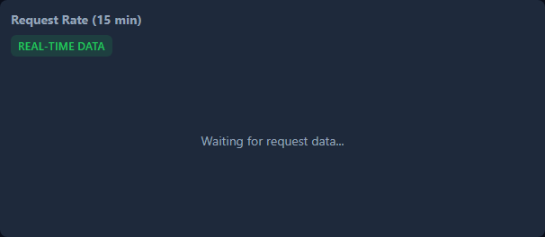

# Dashboard Guide

The AI Proxy includes a comprehensive real-time dashboard for monitoring requests, managing routing, and diagnosing issues.

## Accessing the Dashboard

Once the proxy is running, access the dashboard at:

```
http://127.0.0.1:18765/dashboard
```


## Dashboard Sections

### Health Ribbon

The top ribbon shows key health metrics at a glance:

- **Uptime** - How long the proxy has been running
- **Success Rate** - Percentage of successful requests
- **Requests/min** - Current request rate
- **Active Connections** - Currently processing requests


### Keys Heatmap

Visual representation of API key health and performance:

- Green cells indicate healthy keys
- Color intensity shows request volume
- Red cells indicate failing or circuit-broken keys


### Cost Panel

Track your API spending in real-time:

- Current session cost
- Projected daily/monthly costs
- Per-model cost breakdown


### Request Charts

Real-time charts showing request patterns:

- **Request Rate** - Requests per minute over time
- **Latency** - Response time distribution
- **Error Rate** - Failed request percentage



## Main Pages

### Overview Page

The default landing page shows all key metrics and the live request stream.


### Requests Page

Monitor live and historical requests:

- **Live Stream** - Real-time incoming requests
- **Traces** - Detailed request traces
- **Logs** - Application logs
- **Queue** - Request queue status
- **Circuit** - Circuit breaker states


### Model Routing Page

Configure and monitor model routing:


#### Tier Builder

Drag-and-drop interface for configuring routing tiers:


### System Page

Diagnostics and advanced metrics:


#### Error Breakdown

Categorized error analysis:


#### Retry Analytics

See how retries are performing:


## Live Stream Panel

The bottom drawer contains the live request stream and related tabs:

### Collapsed View


### Expanded View


### Dock Tabs

Switch between different views:

| Tab | Description |
|-----|-------------|
| **Live** | Real-time request stream |
| **Traces** | Detailed request traces |
| **Logs** | Application logs |
| **Queue** | Request queue status |
| **Circuit** | Circuit breaker states |


## Theme and Display Options

### Themes

Toggle between dark and light themes:


### Density Modes

Adjust the layout density:

- **Compact** - More information in less space
- **Comfortable** - Balanced spacing (default)


## Keyboard Shortcuts

Press `?` to see all keyboard shortcuts:


### Essential Shortcuts

| Shortcut | Action |
|----------|--------|
| `?` | Show keyboard shortcuts |
| `g` + `o` | Go to Overview |
| `g` + `r` | Go to Routing |
| `g` + `s` | Go to System |
| `l` | Toggle live stream |
| `t` | Toggle theme |
| `1-5` | Switch dock tabs |

## Progressive Disclosure

Advanced sections are collapsed by default to reduce visual clutter:

### Advanced Statistics

Lifetime stats, AIMD concurrency, and predictions:


### Process & Scheduler

System health and scheduler metrics:


## Responsive Design

The dashboard adapts to different screen sizes:

### Mobile (375px)


### Tablet (768px)


### Desktop (1920px)


## Navigation

The dashboard supports URL-based navigation for bookmarking and sharing:

- `/dashboard` - Overview page (default)
- `/dashboard#requests` - Requests page
- `/dashboard#routing` - Model Routing page
- `/dashboard#system` - System page

Sub-pages are also supported:
- `/dashboard#requests/live` - Live stream tab
- `/dashboard#requests/traces` - Traces tab
- `/dashboard#routing/tiers` - Tiers sub-tab

## Next Steps

- [Configuration](./configuration.md) - Customize proxy settings
- [Monitoring](./monitoring.md) - API endpoints for monitoring
- [Model Routing](../features/model-routing.md) - Detailed routing configuration
