# Dashboard Guide

The AI Proxy includes a comprehensive real-time dashboard for monitoring requests, managing routing, and diagnosing issues.

## Accessing the Dashboard

Once the proxy is running, access the dashboard at:

```
http://127.0.0.1:18765/dashboard
```


## Dashboard Navigation

### Page Navigation Tabs

Switch between main dashboard pages using the navigation tabs in the header:


| Tab | Description |
|-----|-------------|
| **Overview** | Key metrics, charts, and live stream |
| **Requests** | Live traces, logs, queue, and circuit status |
| **Routing** | Model routing configuration and tier management |
| **System** | Diagnostics, error breakdown, and health score |

### Connection Status

The header shows the live connection status to the upstream API:


- **Green dot** - Connected and receiving events
- **Yellow dot** - Connected but no recent events
- **Red dot** - Disconnected or connection error

### Pause/Resume Control

Pause the proxy to stop accepting new requests (useful for maintenance):


When paused, all incoming requests return `503 Service Unavailable` until resumed.

## Dashboard Sections

### Health Ribbon

The top ribbon shows key health metrics at a glance:

- **Uptime** - How long the proxy has been running
- **Success Rate** - Percentage of successful requests
- **Requests/min** - Current request rate
- **Active Connections** - Currently processing requests

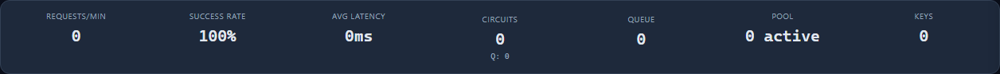

### Keys Heatmap

Visual representation of API key health and performance:


- **Green cells** - Healthy keys with high success rates
- **Yellow cells** - Keys with warnings or degraded performance
- **Red cells** - Failing or circuit-broken keys
- **Color intensity** - Indicates request volume (brighter = more requests)
- **Pulsing border** - Key has in-flight requests

### Cost Panel

Track your API spending in real-time:


- Current session cost
- Projected daily/monthly costs
- Per-model cost breakdown

### Request Charts

Real-time charts showing request patterns:


- **Request Rate** - Requests per minute over time
- **Latency** - Response time distribution (P50, P95, P99)
- **Error Rate** - Failed request percentage

## Main Pages

### Overview Page

The default landing page shows all key metrics and the live request stream.


### Requests Page

Monitor live and historical requests:

- **Live Stream** - Real-time incoming requests
- **Traces** - Detailed request traces
- **Logs** - Application logs
- **Queue** - Request queue status
- **Circuit** - Circuit breaker states


### Traces Tab

View detailed request information including timing, model used, and retry attempts:


### Logs Tab

Application-level logs for debugging:


### Model Routing Page

Configure and monitor model routing:


#### Model List

View all configured models with their pricing, tier assignments, and concurrency limits:


#### Tier Builder

Drag-and-drop interface for configuring routing tiers:


### System Page

Diagnostics and advanced metrics:


#### Circuit Breaker Indicators

View the current state of all circuit breakers:


- **Green** - Closed (normal operation)
- **Yellow** - Half-Open (testing recovery)
- **Red** - Open (circuit tripped, requests blocked)

#### Error Breakdown

Categorized error analysis:


#### Retry Analytics

See how retries are performing:


## Live Stream Panel

The bottom drawer contains the live request stream and related tabs:

### Collapsed View

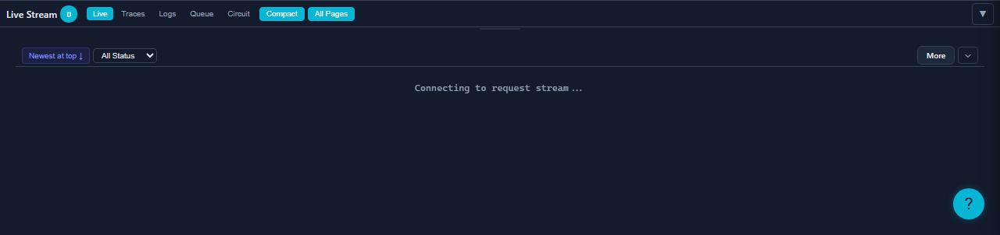

### Expanded View

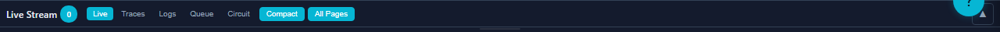

### Dock Tabs

Switch between different views:

| Tab | Description |
|-----|-------------|
| **Live** | Real-time request stream |
| **Traces** | Detailed request traces |
| **Logs** | Application logs |
| **Queue** | Request queue status |
| **Circuit** | Circuit breaker states |


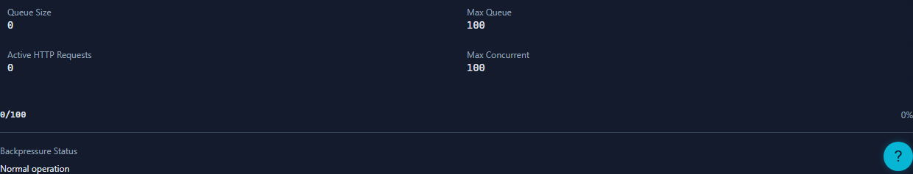


## Theme and Display Options

### Themes

Toggle between dark and light themes using the theme button:


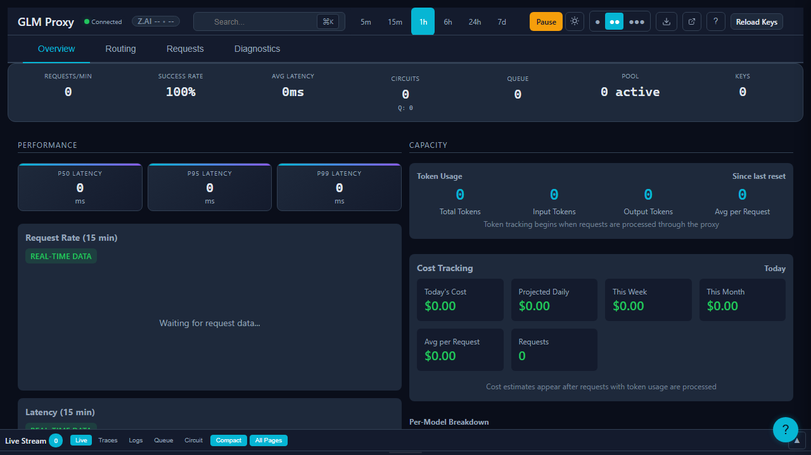
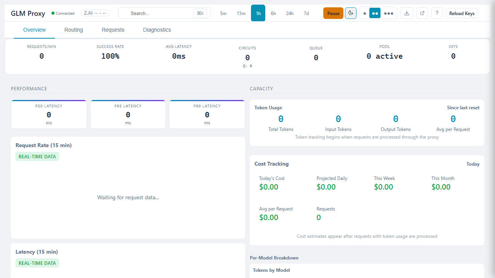

### Density Modes

Adjust the layout density using the density selector:

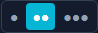

- **Compact** - More information in less space
- **Comfortable** - Balanced spacing (default)


### Time Range Selector

Change the time window for charts and statistics:

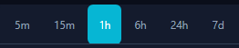

Options: 5m, 15m, 1h, 6h, 24h, 7d

## Keyboard Shortcuts

Press `?` to see all keyboard shortcuts:

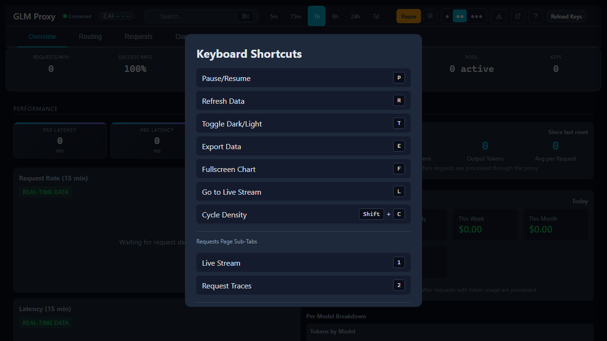

### Essential Shortcuts

| Shortcut | Action |
|----------|--------|
| `?` | Show keyboard shortcuts |
| `P` | Pause/resume proxy |
| `R` | Switch to Requests page |
| `T` | Toggle theme |
| `E` | Toggle density |
| `L` | Toggle live stream panel |
| `F` | Toggle focus mode |
| `Ctrl+K` | Open search |
| `g` + `o` | Go to Overview |
| `g` + `r` | Go to Routing |
| `g` + `s` | Go to System |
| `1-5` | Switch dock tabs |
| `Esc` | Close modals/drawers |

## Progressive Disclosure

Advanced sections are collapsed by default to reduce visual clutter:

### Advanced Statistics

Lifetime stats, AIMD concurrency, and predictions:


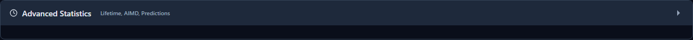

### Process & Scheduler

System health and scheduler metrics:


## Responsive Design

The dashboard adapts to different screen sizes:

### Mobile (375px)


### Tablet (768px)

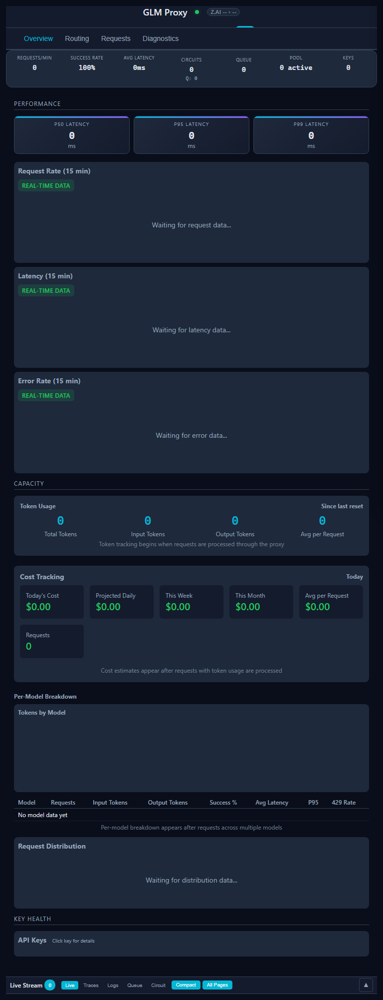

### Desktop (1920px)

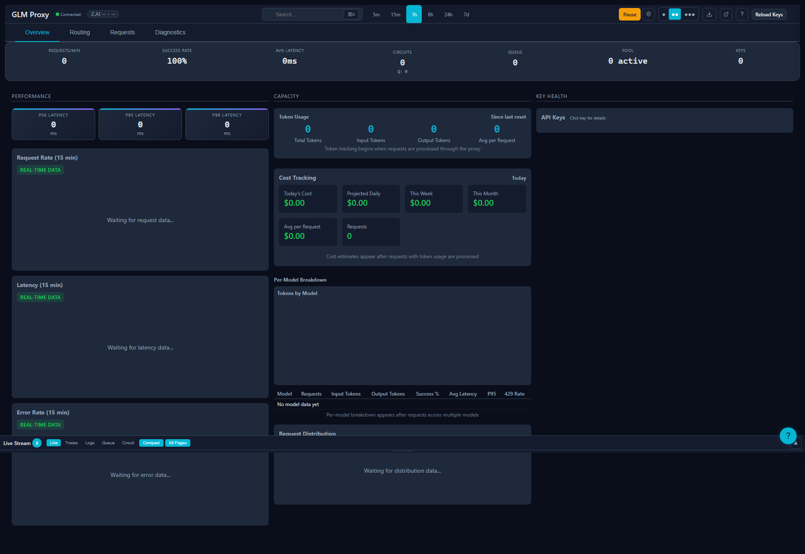

## Navigation

The dashboard supports URL-based navigation for bookmarking and sharing:

- `/dashboard` - Overview page (default)
- `/dashboard#requests` - Requests page
- `/dashboard#routing` - Model Routing page
- `/dashboard#system` - System page

Sub-pages are also supported:
- `/dashboard#requests/live` - Live stream tab
- `/dashboard#requests/traces` - Traces tab
- `/dashboard#requests/logs` - Logs tab
- `/dashboard#requests/queue` - Queue tab
- `/dashboard#requests/circuit` - Circuit tab

## Next Steps

- [Configuration](./configuration.md) - Customize proxy settings
- [Monitoring](./monitoring.md) - API endpoints for monitoring
- [Model Routing](../features/model-routing.md) - Detailed routing configuration
